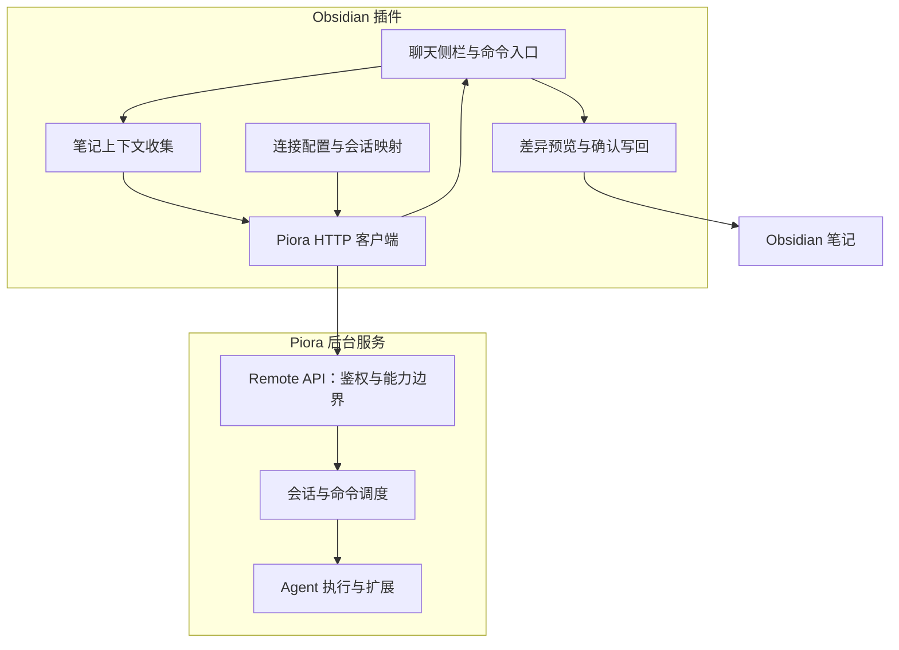

# Piora for Obsidian 设计方案

- 状态：设计草案已有部分原型实现，尚未完成宿主验收。
- 日期：2026-09-13。
- 仓库：`JohnJAS/piora-obsidian`。
- 基线：2026-09-09 核对的 Piora 本地工作区，HEAD 为 `9c361d17427f00414ca3050f0db3e51f525b42cf`。工作区可能有未提交变化，该提交号仅作定位线索，不保证对应全部核对内容或已发布版本。

本文保留原始设计与路线，不承诺与 Claudian 全功能对齐。下文原始“现有接口”以设计基线为准；当前实现增量与未完成项见本节及 README，不应把全部设计当成已交付能力。

逐项证据和未完成要求见[实现与验收状态](acceptance.zh-CN.md)。草稿与引用在投递期间允许继续编辑，确认回执只移除本次发送快照，不覆盖后来编辑的输入；设置和新建会话入口共用既有配置与模式确认流程。

## 当前实现增量（截至 2026-09-10）

- 分层：core 负责输入及写回检查，client 负责本机 Node HTTP/SSE，session 负责幂等和运行状态，main 适配 Obsidian。reply-contexts 将笔记快照绑定到具体回复，vault-path 检查实际文件路径边界。
- 服务端新增 policy=notes/agent、模型目录和正文快照流。notes 策略写入会话文件且创建时立即持久化，恢复后不加载扩展、技能或项目上下文，工具集为空；完整 Agent 保持原能力并显式提示风险。
- 正文流使用 content.snapshot 同步有界文本及工具名称，并通过 toolLifecycle=tool-calls-v1 协商工具调用状态与纯文本输出预览，不透传 thinking、工具参数或原始 SDK 事件；历史和状态用于最终校准，撤销权限后关闭正文流。
- 内容身份协商为 run-sequence-v1：sessionId 限定会话，streamId 标识运行包装器实例，runId 标识逻辑提示，sequence 在实例内随内容和运行切换递增。streamId 不是稳定服务身份，不替代 serverId 或用于自动信任迁移。客户端隔离旧连接回调、重复/倒序帧和已结束运行；较慢的 HTTP 状态/历史响应不能覆盖更晚的实时帧，生命周期事件仅触发校准而不直接覆盖界面状态。
- 正文在逻辑提示被接纳时清空，而非每次 SDK agent_start；同一提示内部重试继续保留正文。包装器结束触发 stream.reset，权限撤销仍返回 REMOTE_ACCESS_ENDED 并停止连接。未知内容身份协议明确降级为历史同步，不假装支持可靠增量。
- 凭证关闭记忆与显式忘记均只作用于归一化地址和当前 Vault 对应的凭证键；通过宿主 API 写入空保存值，不声称删除存储介质记录。关闭记忆保留本次内存值，忘记操作清空内存并断开，但不撤销 Piora 端令牌。失败显式提示，不跨连接清除凭证。
- 消息回执按服务地址、serverId 及幂等键保存多条会话/命令元数据，不持久化消息正文。恢复后逐项核对终态，引导完成不丢弃原任务，解除未知投递不清空已确认任务；其他或未知实例回执保留但不自动恢复。创建回执单独持久化原参数白名单、capabilityId、幂等键及可选 sessionId，发送前落盘，选择落盘后才清理；重启只恢复回执，需用户显式重试。
- 创建重试保持原参数和键，拒绝用修改后的设置覆盖未完成请求；令牌身份不同时拒绝重试，服务端 X-Piora-Capability-Id 检查防止探测后的令牌变化导致键归属改变。ack 已落盘时只重试选择而不再次 POST。连接代次变化时不发送尚未发出的请求，也不让迟到回执重开订阅；已确认的 sessionId 仍持久化。当前验证覆盖客户端重启/响应丢失，不声称已经消除服务端 createSession 成功但授权幂等记录尚未落盘时的进程崩溃窗口。
- 服务端创建现在先持久化创建意图和 JSONL 种子，再初始化并在令牌存储锁内完成授权；真实子进程终止测试覆盖初始化中、授权前和授权后恢复。真实 Next 重启注入仍待验收，不能把它写成已完成的宿主验收。
- 已实现显式引用、差异确认、冲突拒绝、路径边界检查、会话切换、停止/引导和模型选择；自动化已覆盖核心行为，真实 Obsidian UI 和编辑器撤销尚未验收。
- 排队沿用 Remote messages 的 next_turn，单条取消通过新增 POST /commands/:id/cancel，并由 commandCancellation 能力发现控制。每会话最多跟踪 10 条未完成命令、每服务 100 条；每个排队回复绑定各自的笔记快照。取消回执不等同于整个会话停止，原有停止操作不清空队列。
- 新创建令牌持久化 creationPolicy：allowedPolicies 默认仅 notes，cwdRoots 默认空（拒绝新建）。签发时保存真实目录锚点，创建前复核当前令牌与真实路径，拒绝越界和被重定向的目录锚点。当前会话授权需用户显式勾选，避免 notes-only 创建令牌自动取得已有 Agent 会话。
- 能力发现 sessionCreation 返回此令牌的 allowedPolicies、cwdRoots 和 legacyUnrestricted；features.sessionPolicies 仅表示服务器支持的模式。客户端在发请求前拒绝不允许的模式，目录校验以服务端为准。旧令牌缺字段时保留兼容但标明 legacy；坏策略记录认证失败，不退回无限制。
- 生命周期 SSE 输出前及空闲每秒复核授权，撤销后返回 REMOTE_ACCESS_ENDED 并释放订阅/定时器；取消、预先 abort 和迟到状态响应均不泄漏监听器。重放待处理上限 128 事件、单帧 64 KiB、输出队列 256 KiB（另允许一个固定终止帧），超限发送 stream.reset 后关闭。仍保持 snapshot、id/cursor、Last-Event-ID 和 after 兼容；客户端通过重连及 HTTP 校准恢复。不能撤回已发送的数据或保证被阻塞事件循环中的硬实时撤销。
- 已实现数据目录级稳定 serverId：单独 identity.json 文件加跨进程锁及原子持久化，损坏不自动重建，不影响 token 文件。匿名 /identity 仅返回 protocol 和 serverId；capabilities 与本地设置显示同一 ID。插件先匿名核对、落盘绑定，再发送令牌，后续携带期望实例头；绑定失败不使用临时内存信任。设置中的显式更换会清凭证、关闭记忆，不迁移旧回执。无身份接口的服务须升级，不静默使用无绑定模式。
- 按需本地多笔记检索已实现：关键词匹配路径/正文、文件夹范围、未保存编辑器优先、逐项选择后引用；不自动注入整库。图片与 UTF-8 文本附件、本用户目录登记发现已实现（格式/限额见对应契约）；工具状态、输出预览及历史对齐已有自动化与真实 SDK/HTTP 证据，真实宿主及压力验收仍待完成。创建目录限制不是 Agent 工具的文件系统沙箱，也不降级已明确授权会话；不能将 notes 会话策略等同于整个服务的权限隔离，不宣称 P0–P3 全部完成。

## 1. 产品定位

独立 Obsidian 插件替代 Claudian 的日常交互入口。Obsidian 负责聊天、笔记上下文、修改确认；Piora 负责模型调用、持久会话和工具执行。

用户启动 Piora，在远程控制设置中创建专用令牌，将地址和令牌配置到插件。Piora 在后台运行，不把整个 Agent 引擎嵌入 Obsidian。插件不保存模型服务商 API Key，不维护第二套模型配置。

首版支持桌面端、本机连接。暂不做移动端、远程 Vault 同步、多租户、整库自动修改、网页嵌入或 MCP 桥接。

## 2. 界面与入口

```text
┌──────────────────────────────────┐
│ Piora   ● 已连接      会话 ▾  ＋  │
├──────────────────────────────────┤
│ 当前会话：整理项目笔记            │
│ 模型：使用 Piora 会话配置         │
├──────────────────────────────────┤
│ 用户：帮我整理这篇笔记            │
│ Piora：……                        │
│ [插入光标处] [新建笔记] [查看差异] │
├──────────────────────────────────┤
│ 引用：项目记录.md ×  选中文字 ×   │
│ 输入消息……                       │
│ [添加笔记]          [停止 / 发送] │
└──────────────────────────────────┘
```

- 侧栏：聊天、新建/切换会话、运行状态、结果操作。
- 编辑器右键：解释、总结、改写选中文字。
- 命令面板：打开 Piora、引用当前笔记、新建会话。

发送前显示引用列表与体积，可移除单项。默认不发送整个 Vault，不自动展开全部链接笔记。

## 3. 架构



插件只依赖 Remote API，不复用 Piora 内部 React 组件或内部管理路由。UI、协议传输、会话状态、笔记写回分层。编辑器未保存文本由插件管理，Piora 不直接理解编辑器缓冲区。

## 4. 现有接口与差距

公共前缀为 `/api/remote/v1`，它不是网页。请求携带 `Authorization: Bearer <token>`，实际地址从 Piora 设置取得，不硬编码桌面临时端口。

| 能力 | 现有接口（省略前缀） |
| --- | --- |
| 能力发现 | `GET /capabilities` |
| 创建、列出会话 | `POST /sessions`、`GET /sessions` |
| 状态、历史 | `GET /sessions/:id/state`、`GET /sessions/:id/history` |
| 工具与命令描述 | `GET /sessions/:id/tools` |
| 消息 | `POST /sessions/:id/messages` |
| 引导、中止 | `POST /sessions/:id/steer`、`POST /sessions/:id/abort` |
| 生命周期事件 | `GET /sessions/:id/events` |
| 命令状态 | `GET /commands/:id` |

令牌受 scope 与会话白名单约束；允许创建的令牌自动获得其新会话访问权。创建和消息发送使用稳定 `Idempotency-Key`；消息返回 `202` 和 `commandId`，并非最终回复。

必须正视的差距：

- `SessionCommandEvent` 主要覆盖任务和命令生命周期，不是逐字正文或完整工具过程。P0 用状态事件加最终历史，P2 补内容流。
- 创建支持成对 `provider` / `modelId` 和 `thinkingLevel`，但当前远程能力清单没有模型目录接口。P0 使用默认模型。
- 远程创建参数未公开受约束的工具策略，不能宣称会话天然只读。
- 单次 JSON 上限为 256 KiB，需检查序列化后的完整字节数，包括转义、元数据和媒体开销。
- 鉴权层有限流，采用事件优先、稀疏轮询、退避并遵循 `429` / `Retry-After`。

基线核对路径（相对 Piora 仓库）：`docs/remote-http-api.zh-CN.md`、`app/api/remote/v1/capabilities/route.ts`、`app/api/remote/v1/sessions/route.ts`、`app/api/remote/v1/sessions/[id]/events/route.ts`、`lib/session-message-types.ts`、`lib/remote-control-request.ts`、`lib/remote-control-auth.ts`。

## 5. 连接与身份

保存服务地址、凭证引用、连接标识、Vault/会话映射、待确认消息幂等键和命令 ID。完整历史以 Piora 为准，不默认在 Vault 复制一份。

先调用 `/capabilities` 验证协议和权限，禁用未授权功能并说明缺失 scope。使用插件专用令牌，不复用桌面认证令牌或模型凭证。

当前配套实现已提供稳定 `serverId` 和匿名身份读取。首次显式连接信任手动地址（TOFU），后续按地址核对保存的 ID，禁止自动跨地址迁移令牌/回执、扫描端口或跟随跨来源重定向。服务端在鉴权前核对 X-Piora-Server-Id，身份绑定的长连接持续校验 ID。期望实例不符返回 409；ID 自报不是认证证书，不能防御伪造 ID 的恶意本机服务或探测—发送竞态。共享/复制 Remote 数据目录也共享身份，不能把 serverId 当成每进程唯一身份。

令牌优先使用宿主秘密存储，最低兼容版本待原型验证；不支持则仅存内存，不静默降级成普通配置明文。日志不包含令牌或完整笔记正文。

首版仅支持本机回环连接。远程部署另行设计 HTTPS、实例信任、文件传输；不能通过关闭服务端来源校验绕过集成问题。

### 已实现的本机登记发现

发布者在 Node instrumentation 异步启动，读取 Next 实际 PORT，不信任请求 Host，也不猜默认端口。默认写入当前系统用户 ~/.piora/services，PIORA_DISCOVERY_DIR 可覆盖，PIORA_DISCOVERY_DISABLED=1 禁止启动发布。文件名为 pid-instanceId.json；version=1、protocol=piora.remote.discovery.v1，白名单字段只有 serverId、instanceId、pid、address、updatedAt、expiresAt，不含令牌、Vault 路径或会话正文。

同一 Node 进程通过 globalThis 共享启动 Promise；每次启动用独立 instanceId，20 秒续期、90 秒有效期，私有原子替换。停止只删除仍属于自己的记录，强制退出可能残留，续期失败则停止登记而不关闭手动接口。instanceId/pid 用于登记归属，不等同于持久 serverId，也不是进程身份证书。不同地址共享数据目录时可拥有相同 serverId，仍不自动搬迁凭据。

插件仅在用户打开发现界面后枚举固定目录，拒绝检出的目录链接、文件链接/硬链接、过大或不合法记录；POSIX 校验所有者和私有权限，Windows 依赖用户目录继承 ACL 而不声称完成 ACL 审计。目录登记只是来源可说明的本机线索，不提供密码学服务认证，不抵御恶意同用户进程伪造文件/ID或文件系统竞态。

最多枚举 128 个目录项、选择 16 个有效候选、2 路并发、单请求 2 秒；每份登记/匿名身份响应最多 4 KiB。只请求规范化回环 Remote /identity，不跟随重定向、不调用凭证回调、不扫描未登记端口。租期、记录 ID 与当前匿名身份全部匹配才展示，重复地址/ID合并；过期/坏记录跳过，达到限额显式提示。文件 IO 不能保证被硬中断，但取消后的结果不会回填。

选择须二次确认，再匿名复核；身份冲突、未确认任务/创建或保存失败不得替换连接设置。地址/ID 先持久化再应用，清空最近会话选择，但保留旧地址的令牌和回执。之后仍须明确连接；已有目标地址凭证只在后续连接时使用，不从其他地址复制。发现关闭、刷新、卸载均取消旧扫描。

## 6. 消息与上下文

引用保存 Vault 内相对路径、快照、内容哈希和选区。活动笔记优先从编辑器读取，避免遗漏未保存修改。笔记属于不可信上下文，不能变成插件控制指令或权限授权。

P0 在现有 `content` 中以清晰分隔的文本附加引用，不假设有结构化材料上传接口。超限时提示用户缩减引用，不静默截断或自动拆成多轮。

本地多笔记检索采用按需扫描，而非后台整库索引或外部向量服务：空格分词、大小写不敏感的字面匹配，全部词须在路径/正文中命中，路径命中优先排序。可指定相对文件夹（按目录段匹配），只接受普通 Markdown 路径；读取前后校验真实路径仍在 Vault 内。使用已打开编辑器当前文本，其他文件通过 Vault.read 读取。检索不连接 Piora，不保存查询、内容或索引。

每次最多 500 个合法候选，单文件 256 KiB、总读取预算 8 MiB，最多返回 20 项及 240 字符附近的文本摘要；文件过大/不可读/路径越界计入跳过，截断搜索范围或结果时显式提示。预算在读取前后检查，不作为恶意本机并发文件系统变更下的硬内存/IO 隔离承诺。结果只作定位，不自动加入上下文；用户逐项加入时重新读取完整快照，发送仍按完整序列化请求限额拒绝超量。摘要用纯文本渲染；新查询、关闭弹窗、卸载均取消旧检索，迟到结果不能写回界面。

发送流程：

1. 收集快照，检查完整请求大小。
2. 为逻辑消息生成并保存稳定幂等键。
3. 创建或复用获准会话。
4. 打开生命周期订阅，再发送消息。
5. 保存 `commandId`，显示排队/执行/完成。
6. 用命令、会话状态校准，结束后读取历史展示最终回复。

超时不代表未送达，重试必须复用幂等键。P0 运行时禁用重复普通发送，保留停止；排队和引导后续再加。

### 附件契约（已实现格式）

附件选择器、输入框文件粘贴/拖入和 Vault 文件选择均只建立本次内存快照，仍由用户点击发送/排队/引导。支持 PNG/JPEG/GIF/WebP 与 UTF-8 的 txt/md/csv/tsv/json/yaml/yml/log；PDF/Office 等其他格式尚未支持。来源为 Vault 时通过真实路径边界校验；来源为显式本机文件选择时仅使用 File 字节，不拿文件名访问文件系统。隐藏路径、活动文档格式、二进制伪装文本及扩展名/文件头不符被拒绝。

文本作为明确标注的不可信附件 JSON 拼入 content，图片名称/顺序仅作上下文标记，图片数据放在独立 images 数组（type=image、mimeType、data Base64），不把 Base64 放入提示词。messageImages=base64-images-v1 负责协议协商，图片仍需要原有消息/引导 scope，不新增文件上传或内部 materials 接口。服务端在 prompt/steer/follow_up 入队执行前检查当前模型的 image 输入能力，缺失则失败；不擅自更换模型。

插件每附件原始字节上限 128 KiB、每次最多 8 个；完整 JSON 包含转义和 Base64 的 256 KiB 检查在投递前执行。没有隐式压缩、截断、分片或多轮发送。只有附件而没有草稿时生成默认分析提示；不存在无提示的隐式后台调用。选中附件按名称/字节数列出，可移除；不执行附件 HTML、脚本或远程 URL，也不自动嵌入历史媒体。

读取中的附件不能同时投递；一组选择全部读取和验证成功后才加入列表。pending 请求复制图片字段，重试使用原内容和原键；回执后仅清理本次对象，后续新增保留。附件正文/图片不进入普通插件配置或回执记录，重启不自动重发。卸载递增导入代次，迟到读取不能复活附件；以上不是磁盘/内存安全擦除承诺。服务端正常会话历史可能保存已发送内容，这与插件不额外落盘是不同边界。

验证包括合成文件/宿主替身、Vault junction 越界拒绝、媒体计入完整请求、同键重试、文件粘贴/拖入入口；隔离真实 HTTP 验证图片数据和文本确实到达合成视觉模型、丢回执只执行一次，以及文本模型明确失败且不调用模型。真实 Obsidian 原生选择器/剪贴板/大文件体验仍待宿主验收。

## 7. 断线与恢复

- 断线只表示连接中断，不直接判断任务失败。
- 使用带抖动的指数退避，并遵循服务端限流提示。
- 重连读取命令、状态、历史；游标只是辅助机制，不假设无限保留或跨进程稳定。
- 本地运行身份与服务端 `runId` 分开处理，旧会话/运行事件不能覆盖当前界面。
- 插件关闭只断开客户端，不默认中止后台任务。
- 重启或令牌失效显示明确状态，不自动创建重复会话或任务。
- 依据稳定消息/条目标识去重，不把首次收到的结束事件视为整个逻辑任务必然完成。

## 8. 笔记写回与执行策略

### 8.1 笔记助手：正式版建议默认

用户显式提供内容，Piora 返回建议，插件预览差异并确认写入。服务端必须阻止写文件工具、Shell、浏览器及扩展绕过确认；提示词、前端按钮和 `cwd` 都不是执行隔离。

会话级 notes 策略、恢复限制及每令牌创建策略/cwd 边界已实现；旧令牌兼容限制见实现状态。完整工具会话仍仅适用于可信用户，不宣传为只读安全模式。服务端不得允许客户端放宽已有 notes 会话策略。

### 8.2 完整 Agent：显式启用

可把 Vault 作为工作目录并使用获准工具。Agent 可能直接修改文件，插件确认并非全局门禁；界面持续提示风险，建议备份或版本管理。

### 8.3 插件确认流程

选择插入/替换/新建后，比较当前文本与生成建议时的快照，无冲突才展示差异并确认；有冲突则重新生成或手动合并，不静默覆盖。

首版只支持单笔记、单次确认。活动编辑器修改进入撤销历史，非活动笔记通过宿主接口写入时再次校验。模型路径必须验证为 Vault 内目标，不能越界、覆盖式新建或执行输出中的命令。删除、重命名、链接维护、多文件事务和自动合并不在首版范围。

## 9. 拟议服务端扩展

本节保留设计方案中的扩展方向。当前已实现受限会话、每令牌创建策略、模型目录、带运行身份的正文/工具快照流、稳定数据目录身份和有界本机登记发现。以下建议事件名不是当前对外协议，工具过程使用下述快照扩展而非逐事件透传。

### 已实现的工具快照扩展

- capabilities.features.toolLifecycle 为 tool-calls-v1。只有明确协商该值，插件才读取 content.snapshot.toolCalls；生命周期 SSE 不变。
- toolCalls 每项仅含 toolCallId、toolName、status（running/succeeded/failed）、output、truncated。外层 sessionId/streamId/runId/sequence 继续承担会话、包装器、逻辑运行与排序隔离；toolCallId 对齐助手历史中的调用和 toolResult，未伪造 SDK 不提供的独立 messageId。
- SDK start 建卡，update 用当前部分结果替换预览，end 用最终结果替换并固化成功/失败；完成后的迟到更新不倒退状态。快照最多 20 项，省略计数为 omittedToolCalls，每项输出最多 2000 字符。运行切换清空，重连恢复当前快照，不承诺重放每次部分更新。
- UI 对同一 toolCallId 只显示一张卡：历史明确终态优先；未完成历史项使用活动状态；无明确终态也无活动快照显示「未收到结果」。终态 HTTP 历史校准后清除活动卡，按历史展示结果。展开状态在刷新时保持。
- 只投影工具结果 content 中的 text 块；不传参数、details、图片数据或 thinking。工具文本本身仍可能敏感，不做自动脱敏承诺。输出通过 textContent/pre 呈现，不解析 HTML、Markdown、图片或链接。历史预览同样截断并提示到 Piora 核对。
- 单元/UI 测试覆盖并行调用、部分更新、终态、旧事件与限额；隔离 HTTP 使用真实 Agent SDK 对合成文件执行成功/失败 read，验证 SSE 卡片与终态历史。真实 Obsidian 宿主与大规模压力仍未验收。

### 内容事件流

保留生命周期 SSE，另加内容流或通过能力协商扩展，不悄悄改变旧协议。

| 建议事件 | 用途 |
| --- | --- |
| `message.started` | 创建助手消息 |
| `message.delta` | 追加正文 |
| `message.completed` | 固化消息 |
| `tool.started` / `tool.completed` | 工具卡片 |
| `stream.reset` | 丢弃不可恢复增量并重新同步 |

携带 `sessionId`、`runId`、`messageId`、序号及适用时的 `commandId`。明确流身份、重放范围、游标失效、结束语义与历史对齐。终态历史不是活动正文快照，丢失增量时需活动快照，或降级为等待最终历史。

不透传全部 SDK 内部事件和敏感字段。订阅需鉴权，长连接处理过期、撤销、会话授权变化；内容和工具输出有限额及安全渲染策略。

### 受限会话与能力发现

服务端控制工作目录、工具/扩展集合、写入权限及令牌可创建的策略类型。只增加外部接入必要边界，不重做全部核心权限模型、不修改核心提示协议。

增加稳定服务身份、协议兼容范围、内容流特性、请求限制和策略发现。模型目录与结构化修改建议后续添加，P0 不依赖。

## 10. 工程结构

```text
src/
  main.ts
  settings/
  views/
  client/
    remote-client.ts
    event-stream.ts
    protocol.ts
  sessions/
    session-store.ts
    run-controller.ts
  context/
    note-context.ts
  changes/
    change-preview.ts
    apply-change.ts
  security/
    credential-store.ts
```

采用 TypeScript 和 Obsidian 插件接口，先做轻量界面。普通 HTTP 与流式连接分开封装，验证 Bearer 请求头、Obsidian 来源、跨域、取消和重连，不假定普通请求接口能流式读取。

实施前核对官方插件 API、最低宿主版本、秘密存储与发行要求。文档阶段不添加无用依赖、构建工具或插件清单。

## 11. 交付与验收

| 阶段 | 范围 | 验收 |
| --- | --- | --- |
| P0 连接原型 | 地址/令牌、能力、会话、消息、状态、结果 | 完成对话，重试不重复执行，明确完整 Agent 风险 |
| P1 笔记助手 | 引用、差异、确认写回、服务端受限策略 | 未确认不能经任何获准能力写入；冲突不覆盖；重启恢复 |
| P2 聊天体验 | 流式、工具、模型、排队/引导 | 断线不重复正文、不丢结果、不受旧运行污染 |
| P3 扩展能力 | 多笔记检索、附件、本机发现、完整 Agent | 分别验证权限、资源限制和文件一致性 |

测试矩阵：

- 鉴权：缺令牌、过期、撤销、scope 不足、未授权会话、跨来源重定向。
- 网络：连接失败、发送超时、SSE 中断、限流、进程重启、游标失效、重复事件。
- 状态：会话切换、后台完成、插件重启、排队、取消、最终状态恢复。
- 上下文：未保存文本、Unicode、超限请求、排除笔记、恶意指令。
- 写回：用户同时编辑、目标移动或删除、越界路径、冲突、撤销。
- 权限：受限模式下 Shell、工具、扩展不能旁路确认。
- 生命周期：关闭视图、禁用插件后清理连接与订阅，不意外中止任务。

## 12. 待确认决策

- 最低 Obsidian 版本、首发平台、秘密存储兼容性。
- 插件名称、插件 ID、发行渠道、许可证。
- Piora 受限策略与 P1 的同步交付方式。
- 内容协议、活动快照、重放保留策略。
- 完整 Agent 的工作目录和风险授权界面。

推荐路线：独立插件 + 现有 Remote API，先验证可信环境聊天闭环，再补服务端受限策略与流式体验。不先做 MCP，不嵌入网页，不在 Obsidian 内重建 Agent 引擎。
