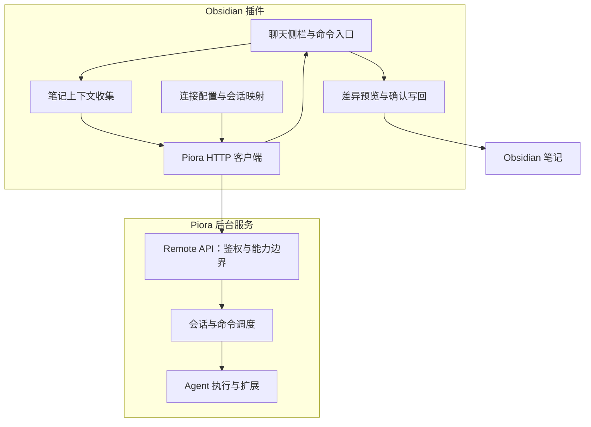

# Piora for Obsidian 设计方案

- 状态：草案，待实施。
- 日期：2026-09-09。
- 仓库：`JohnJAS/piora-obsidian`。
- 基线：2026-09-09 核对的 Piora 本地工作区，HEAD 为 `9c361d17427f00414ca3050f0db3e51f525b42cf`。工作区可能有未提交变化，该提交号仅作定位线索，不保证对应全部核对内容或已发布版本。

本文区分现有能力与拟议能力。本仓库仅包含文档，不承诺与 Claudian 全功能对齐。

## 1. 产品定位

独立 Obsidian 插件替代 Claudian 的日常交互入口。Obsidian 负责聊天、笔记上下文、修改确认；Piora 负责模型调用、持久会话和工具执行。

用户启动 Piora，在远程控制设置中创建专用令牌，将地址和令牌配置到插件。Piora 在后台运行，不把整个 Agent 引擎嵌入 Obsidian。插件不保存模型服务商 API Key，不维护第二套模型配置。

首版支持桌面端、本机连接。暂不做移动端、远程 Vault 同步、多租户、整库自动修改、网页嵌入或 MCP 桥接。

## 2. 界面与入口

```text
┌──────────────────────────────────┐
│ Piora   ● 已连接      会话 ▾  ＋  │
├──────────────────────────────────┤
│ 当前会话：整理项目笔记            │
│ 模型：使用 Piora 会话配置         │
├──────────────────────────────────┤
│ 用户：帮我整理这篇笔记            │
│ Piora：……                        │
│ [插入光标处] [新建笔记] [查看差异] │
├──────────────────────────────────┤
│ 引用：项目记录.md ×  选中文字 ×   │
│ 输入消息……                       │
│ [添加笔记]          [停止 / 发送] │
└──────────────────────────────────┘
```

- 侧栏：聊天、新建/切换会话、运行状态、结果操作。
- 编辑器右键：解释、总结、改写选中文字。
- 命令面板：打开 Piora、引用当前笔记、新建会话。

发送前显示引用列表与体积，可移除单项。默认不发送整个 Vault，不自动展开全部链接笔记。

## 3. 架构



插件只依赖 Remote API，不复用 Piora 内部 React 组件或内部管理路由。UI、协议传输、会话状态、笔记写回分层。编辑器未保存文本由插件管理，Piora 不直接理解编辑器缓冲区。

## 4. 现有接口与差距

公共前缀为 `/api/remote/v1`，它不是网页。请求携带 `Authorization: Bearer <token>`，实际地址从 Piora 设置取得，不硬编码桌面临时端口。

| 能力 | 现有接口（省略前缀） |
| --- | --- |
| 能力发现 | `GET /capabilities` |
| 创建、列出会话 | `POST /sessions`、`GET /sessions` |
| 状态、历史 | `GET /sessions/:id/state`、`GET /sessions/:id/history` |
| 工具与命令描述 | `GET /sessions/:id/tools` |
| 消息 | `POST /sessions/:id/messages` |
| 引导、中止 | `POST /sessions/:id/steer`、`POST /sessions/:id/abort` |
| 生命周期事件 | `GET /sessions/:id/events` |
| 命令状态 | `GET /commands/:id` |

令牌受 scope 与会话白名单约束；允许创建的令牌自动获得其新会话访问权。创建和消息发送使用稳定 `Idempotency-Key`；消息返回 `202` 和 `commandId`，并非最终回复。

必须正视的差距：

- `SessionCommandEvent` 主要覆盖任务和命令生命周期，不是逐字正文或完整工具过程。P0 用状态事件加最终历史，P2 补内容流。
- 创建支持成对 `provider` / `modelId` 和 `thinkingLevel`，但当前远程能力清单没有模型目录接口。P0 使用默认模型。
- 远程创建参数未公开受约束的工具策略，不能宣称会话天然只读。
- 单次 JSON 上限为 256 KiB，需检查序列化后的完整字节数，包括转义、元数据和媒体开销。
- 鉴权层有限流，采用事件优先、稀疏轮询、退避并遵循 `429` / `Retry-After`。

基线核对路径（相对 Piora 仓库）：`docs/remote-http-api.zh-CN.md`、`app/api/remote/v1/capabilities/route.ts`、`app/api/remote/v1/sessions/route.ts`、`app/api/remote/v1/sessions/[id]/events/route.ts`、`lib/session-message-types.ts`、`lib/remote-control-request.ts`、`lib/remote-control-auth.ts`。

## 5. 连接与身份

保存服务地址、凭证引用、连接标识、Vault/会话映射、待确认消息幂等键和命令 ID。完整历史以 Piora 为准，不默认在 Vault 复制一份。

先调用 `/capabilities` 验证协议和权限，禁用未授权功能并说明缺失 scope。使用插件专用令牌，不复用桌面认证令牌或模型凭证。

建议新增稳定 `serverId` 区分实例。现有接口未提供时，地址变化需用户重新确认，不能当作自动可信迁移。禁止扫描端口或把令牌发送到未确认主机、跨来源重定向目标。

令牌优先使用宿主秘密存储，最低兼容版本待原型验证；不支持则仅存内存，不静默降级成普通配置明文。日志不包含令牌或完整笔记正文。

首版仅支持本机回环连接。远程部署另行设计 HTTPS、实例信任、文件传输；不能通过关闭服务端来源校验绕过集成问题。

## 6. 消息与上下文

引用保存 Vault 内相对路径、快照、内容哈希和选区。活动笔记优先从编辑器读取，避免遗漏未保存修改。笔记属于不可信上下文，不能变成插件控制指令或权限授权。

P0 在现有 `content` 中以清晰分隔的文本附加引用，不假设有结构化材料上传接口。超限时提示用户缩减引用，不静默截断或自动拆成多轮。

发送流程：

1. 收集快照，检查完整请求大小。
2. 为逻辑消息生成并保存稳定幂等键。
3. 创建或复用获准会话。
4. 打开生命周期订阅，再发送消息。
5. 保存 `commandId`，显示排队/执行/完成。
6. 用命令、会话状态校准，结束后读取历史展示最终回复。

超时不代表未送达，重试必须复用幂等键。P0 运行时禁用重复普通发送，保留停止；排队和引导后续再加。

## 7. 断线与恢复

- 断线只表示连接中断，不直接判断任务失败。
- 使用带抖动的指数退避，并遵循服务端限流提示。
- 重连读取命令、状态、历史；游标只是辅助机制，不假设无限保留或跨进程稳定。
- 本地运行身份与服务端 `runId` 分开处理，旧会话/运行事件不能覆盖当前界面。
- 插件关闭只断开客户端，不默认中止后台任务。
- 重启或令牌失效显示明确状态，不自动创建重复会话或任务。
- 依据稳定消息/条目标识去重，不把首次收到的结束事件视为整个逻辑任务必然完成。

## 8. 笔记写回与执行策略

### 8.1 笔记助手：正式版建议默认

用户显式提供内容，Piora 返回建议，插件预览差异并确认写入。服务端必须阻止写文件工具、Shell、浏览器及扩展绕过确认；提示词、前端按钮和 `cwd` 都不是执行隔离。

此策略待开发。P0 使用现有完整工具会话时，仅定位为可信用户原型，不宣传为只读安全模式。服务端应校验策略不可由客户端放宽，恢复会话也不能绕过限制。

### 8.2 完整 Agent：显式启用

可把 Vault 作为工作目录并使用获准工具。Agent 可能直接修改文件，插件确认并非全局门禁；界面持续提示风险，建议备份或版本管理。

### 8.3 插件确认流程

选择插入/替换/新建后，比较当前文本与生成建议时的快照，无冲突才展示差异并确认；有冲突则重新生成或手动合并，不静默覆盖。

首版只支持单笔记、单次确认。活动编辑器修改进入撤销历史，非活动笔记通过宿主接口写入时再次校验。模型路径必须验证为 Vault 内目标，不能越界、覆盖式新建或执行输出中的命令。删除、重命名、链接维护、多文件事务和自动合并不在首版范围。

## 9. 拟议服务端扩展

本节均未实现，不代表现有 API。

### 内容事件流

保留生命周期 SSE，另加内容流或通过能力协商扩展，不悄悄改变旧协议。

| 建议事件 | 用途 |
| --- | --- |
| `message.started` | 创建助手消息 |
| `message.delta` | 追加正文 |
| `message.completed` | 固化消息 |
| `tool.started` / `tool.completed` | 工具卡片 |
| `stream.reset` | 丢弃不可恢复增量并重新同步 |

携带 `sessionId`、`runId`、`messageId`、序号及适用时的 `commandId`。明确流身份、重放范围、游标失效、结束语义与历史对齐。终态历史不是活动正文快照，丢失增量时需活动快照，或降级为等待最终历史。

不透传全部 SDK 内部事件和敏感字段。订阅需鉴权，长连接处理过期、撤销、会话授权变化；内容和工具输出有限额及安全渲染策略。

### 受限会话与能力发现

服务端控制工作目录、工具/扩展集合、写入权限及令牌可创建的策略类型。只增加外部接入必要边界，不重做全部核心权限模型、不修改核心提示协议。

增加稳定服务身份、协议兼容范围、内容流特性、请求限制和策略发现。模型目录与结构化修改建议后续添加，P0 不依赖。

## 10. 工程结构

```text
src/
  main.ts
  settings/
  views/
  client/
    remote-client.ts
    event-stream.ts
    protocol.ts
  sessions/
    session-store.ts
    run-controller.ts
  context/
    note-context.ts
  changes/
    change-preview.ts
    apply-change.ts
  security/
    credential-store.ts
```

采用 TypeScript 和 Obsidian 插件接口，先做轻量界面。普通 HTTP 与流式连接分开封装，验证 Bearer 请求头、Obsidian 来源、跨域、取消和重连，不假定普通请求接口能流式读取。

实施前核对官方插件 API、最低宿主版本、秘密存储与发行要求。文档阶段不添加无用依赖、构建工具或插件清单。

## 11. 交付与验收

| 阶段 | 范围 | 验收 |
| --- | --- | --- |
| P0 连接原型 | 地址/令牌、能力、会话、消息、状态、结果 | 完成对话，重试不重复执行，明确完整 Agent 风险 |
| P1 笔记助手 | 引用、差异、确认写回、服务端受限策略 | 未确认不能经任何获准能力写入；冲突不覆盖；重启恢复 |
| P2 聊天体验 | 流式、工具、模型、排队/引导 | 断线不重复正文、不丢结果、不受旧运行污染 |
| P3 扩展能力 | 多笔记检索、附件、本机发现、完整 Agent | 分别验证权限、资源限制和文件一致性 |

测试矩阵：

- 鉴权：缺令牌、过期、撤销、scope 不足、未授权会话、跨来源重定向。
- 网络：连接失败、发送超时、SSE 中断、限流、进程重启、游标失效、重复事件。
- 状态：会话切换、后台完成、插件重启、排队、取消、最终状态恢复。
- 上下文：未保存文本、Unicode、超限请求、排除笔记、恶意指令。
- 写回：用户同时编辑、目标移动或删除、越界路径、冲突、撤销。
- 权限：受限模式下 Shell、工具、扩展不能旁路确认。
- 生命周期：关闭视图、禁用插件后清理连接与订阅，不意外中止任务。

## 12. 待确认决策

- 最低 Obsidian 版本、首发平台、秘密存储兼容性。
- 插件名称、插件 ID、发行渠道、许可证。
- Piora 受限策略与 P1 的同步交付方式。
- 内容协议、活动快照、重放保留策略。
- 完整 Agent 的工作目录和风险授权界面。

推荐路线：独立插件 + 现有 Remote API，先验证可信环境聊天闭环，再补服务端受限策略与流式体验。不先做 MCP，不嵌入网页，不在 Obsidian 内重建 Agent 引擎。
